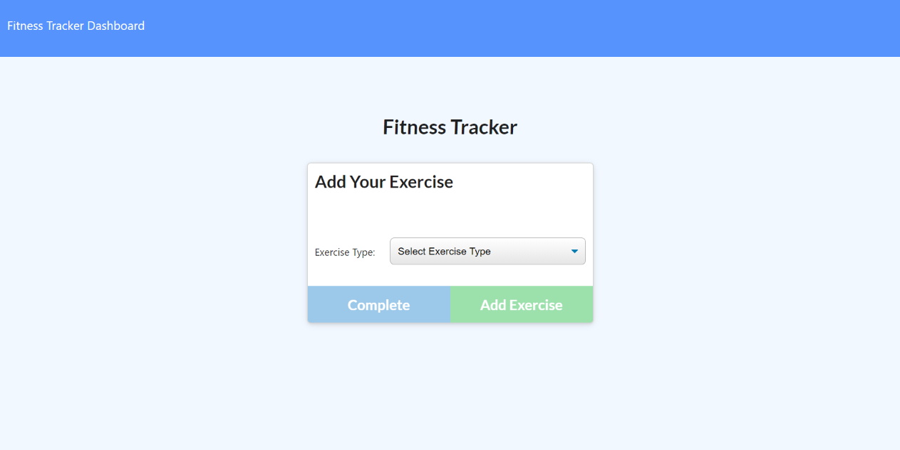

# Fitness Tracker

## Overview
---
This is a Node.js & MongoDB Web Application that log user exercises for the day and display the past 7 days in the dashboard.

## Table of Contents
---
* [Version History](#version-history)
* [Installation Methods](#installation-methods)
* [How It Works](#how-it-works)

* [Links](#links)
* [License](#license)
* [Acknowledgements](#acknowledgements)  

## Version History
---
* Version 0.0 - 24-Mar-2021
    initial working webapp  

## Installation Methods
---
1. Download the `package.json` and all the folders & files and store in the same folder

2. Run `npm install` to install all the required dependencies to run this app

3. Create `.env` folder in the root directory / folder where the index.js files is located, then type the following:
    ```javascript   
    mySQL_PASSWORD = // insert your own password here to connect to your mySQL workbench
    ```
    Then save the .env file

3. Run the app via terminal pointed to the root folder of the application then type: 
    ```javascript
    "node ./index.js"
    ```
* Note: must have `Node.Js` installed first in the computer  

## How It Works
---
1. Click the following [Link](https://fitness-tracker-demo-app.herokuapp.com/) to go to the deployed website
    
2. Choose "Add Workout" to create new workout or "Continue Workout" to continue the current workout


3. Then you will be prompted with options to choose the exercise type and other details. Click "Complete" to go back to the homepage or "Add Exercise" to add other exercise



4. Click on the Dashboard on the top left nav bar to view the "Status" page


## Links
---
* [ GitHub Source Code](https://github.com/vsumargo/FitnessTracker)  

* [Fitness Tracker](https://fitness-tracker-demo-app.herokuapp.com/)

## License
---
License under the MIT license  

## Acknowledgements
---
* **Trilogy Education Services & UWA Coding Bootcamp** - for design guides

* **Luca & Sam** - for their time in teaching HTML, CSS and Javascript

